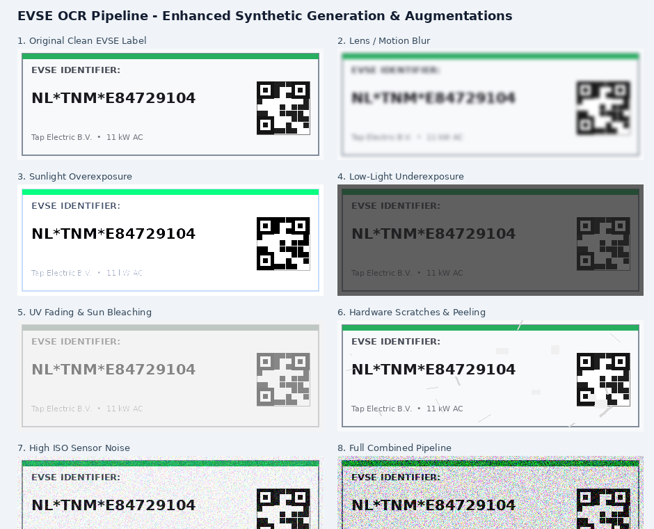
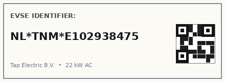
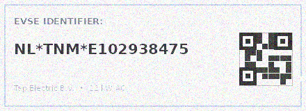
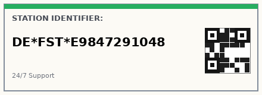
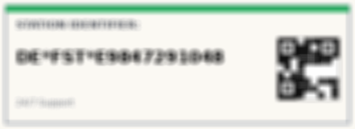
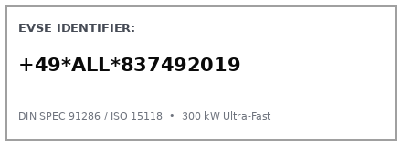
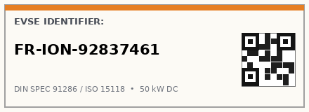
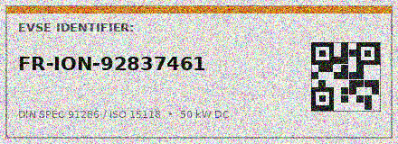

# End-to-End Machine Learning Service for Degraded EVSE ID Recognition and Recovery

A production-grade, distributed machine learning service engineered to capture failed/degraded QR code scan attempts from mobile charging applications, persist telemetry and imagery, and continuously train a Transformer-based Optical Character Recognition (**TrOCR**) model to recover human-readable EVSE (Electric Vehicle Supply Equipment) identifiers.

---

## System Architecture Overview

```
                          +------------------------------------------+
                          |   Mobile Client (Tap Electric App)       |
                          +------------------------------------------+
                                  |                         |
               1. Failed QR Scan  |                         | 2. Direct Fallback
               + Telemetry        v                         v    Inference Request
               +-----------------------------+   +-----------------------------+
               | /api/v1/telemetry/          |   | /api/v1/inference/          |
               | failed_scans                |   | recover                     |
               +-----------------------------+   +-----------------------------+
                               |                                 |
                      (202 Accepted)                             v
                               |                   +----------------------------+
                               v                   | TrOCR Inference Engine     |
               +-----------------------------+    | (ViT Encoder + LM Decoder) |
               | Background Worker           |    +----------------------------+
               +-----------------------------+                  |
                     |                 |                        v
                     v                 v          +----------------------------+
         +---------------+    +----------------+  | EVSE Format Validator      |
         | AWS S3 /      |    | PostgreSQL +   |  | (DIN SPEC 91286 /          |
         | Object Storage|    | PostGIS DB     |  |  ISO 15118-1 + Heuristics) |
         | (Raw Images)  |    | (Spatial Meta) |  +----------------------------+
         +---------------+    +----------------+                |
                                       ^                        v
                                       |          +----------------------------+
                                       +----------| Geospatial Cross-Validator |
                                (Spatial Check)   | (Haversine & PostGIS)      |
                                                  +----------------------------+
```

---

## Key Features

1. **High-Concurrency Telemetry Ingestion API (FastAPI)**
   - Asynchronous multipart upload endpoint handling raw binary image frames alongside environmental telemetry (ambient lux, camera ISO, GPS coordinates, device UUID, and partial QR decodes).
   - Instant `202 Accepted` response with non-blocking background workers offloading persistence.

2. **Bifurcated Storage Architecture**
   - **Object Storage (S3 / MinIO / Local)**: Secure, infinitely scalable raw image buffer store.
   - **Relational Spatial Database (PostgreSQL + PostGIS / SQLite)**: Stores normalized `ScanEvent`, `TextAnnotation`, `ChargingStation`, and `EVSEAsset` models with spatial indices.

3. **Microsoft TrOCR Vision-Language Engine**
   - Vision Transformer (ViT) patch-based visual encoder coupled with an autoregressive RoBERTa language model decoder.
   - Configured with Beam Search ($N=5$) and strict decoding constraints to eliminate hallucinations and resolve character visual ambiguities (e.g., `O` vs `0`, `*` delimiter restoration).

4. **Synthetic Sticker Generation & Optical Degradation Engine (MLOps)**
   - `SyntheticEVSEGenerator`: Generates realistic European standard EVSE stickers (ISO 15118 and DIN SPEC 91286) with TrueType fonts (DejaVuSans, FreeSans, Arimo, Arial), 21–26pt bold typography, simulated 2D QR codes, operator brand accent bars, and power rating tags (`22 kW AC`, `150 kW DC`).
   - `DegradationSimulator`: 5-stage outdoor physical degradation pipeline (Albumentations 2.0+ & high-fidelity PIL fallback) modeling lens blur, sunlight glare, nighttime underexposure, UV sun bleaching, physical scratches, and sensor noise.

5. **Deterministic Regulatory Validation & Geospatial Cross-Referencing**
   - Regex engines strictly verifying **DIN SPEC 91286** (EVCO-ID) and **ISO 15118-1** (EMA-ID) formats.
   - Heuristic optical confusion matrix correction (e.g. `O` $\to$ `0`, `•` $\to$ `*`, whitespace stripping).
   - PostGIS distance checking verifying that predicted identifiers correspond to registered assets near the user's GPS coordinates (default 500m radius).

6. **Closed-Loop Active Learning & Human Auditing**
   - Automated triage flagging low-confidence ($<0.85$), format-invalid, or GPS-mismatched predictions for human review.
   - Annotated ground-truth feeding back into scheduled Hugging Face `Seq2SeqTrainer` fine-tuning runs with CER and WER evaluation metrics.

---

## Synthetic Generation & Augmentation Effects

The system programmatically models outdoor charging post optical degradation:



### Simulated Failure Modes Breakdown

| Degradation Stage | Real-World Failure Mode | Augmentation Implementation |
|---|---|---|
| **1. Original Clean Label** | Base sticker with standard typography & QR code | `SyntheticEVSEGenerator` with TrueType fonts (21–26pt bold) |
| **2. Lens & Motion Blur** | Camera unsteadiness or lens out-of-focus | `MotionBlur(15)`, `GaussianBlur(3-11)`, `Defocus(3-8)` |
| **3. Sunlight Overexposure** | Harsh midday glare & reflective sticker washout | `RandomBrightnessContrast(brightness=0.4-0.6, contrast=0.2-0.4)` |
| **4. Low-Light Underexposure** | Nighttime scanning in unlit parking bays | `RandomBrightnessContrast(brightness=-0.6, contrast=-0.3)` |
| **5. UV Fading & Sun Bleaching** | Sun-bleached and faded thermal ink | `ColorJitter(brightness=0.35, contrast=0.2, saturation=0.05)` |
| **6. Hardware Scratches & Peeling** | Physical abrasion, scratches, and vandalized stickers | `CoarseDropout(num_holes=2-10, hole_size=4-8, fill=255)` |
| **7. High ISO Sensor Noise** | Low-light camera sensor grain | `GaussNoise(std_range=0.08-0.25)` |
| **8. Full Combined Pipeline** | Composite outdoor real-world degradation stack | Multi-stage composite transformation pipeline |

### Clean vs. Degraded Sticker Comparisons

| Standard Format | Original Clean Sticker (Synthetic) | Simulated Outdoor Degraded |
|---|---|---|
| **ISO 15118 (Standard)**<br>`NL*TNM*E102938475` |  |  |
| **ISO 15118 (Fastned)**<br>`DE*FST*E9847291048` |  |  |
| **DIN 91286 / EVCO**<br>`+49*ALL*837492019` |  |  |
| **DIN 91286 (Hyphenated)**<br>`FR-ION-92837461` |  |  |

---

## Directory Structure

```
.
├── Dockerfile                       # Multi-stage container definition
├── docker-compose.yml               # Local stack (FastAPI, PostGIS, MinIO)
├── requirements.txt                 # Pinned dependencies
├── pyproject.toml                   # Project metadata and pytest configuration
├── alembic.ini                      # Database migration configuration
├── alembic/
│   ├── env.py                       # Alembic migration environment
│   └── versions/
│       └── 0001_initial_schema.py   # Initial database schema DDL
├── docs/
│   └── images/                      # Generated synthetic sticker & augmentation assets
├── app/
│   ├── main.py                      # FastAPI application instance & lifecycle
│   ├── config.py                    # Environment settings via Pydantic
│   ├── api/
│   │   ├── router.py                # Top-level API router
│   │   └── v1/
│   │       ├── telemetry.py         # POST /api/v1/telemetry/failed_scans
│   │       ├── inference.py         # POST /api/v1/inference/recover
│   │       └── annotations.py       # Human audit & ground truth endpoints
│   ├── core/
│   │   ├── database.py              # SQLAlchemy engine, session factory & SQLite fallback
│   │   ├── storage.py               # S3 and Local storage abstraction
│   │   └── logging.py               # Structured logger
│   ├── db/
│   │   ├── models.py                # Cross-compatible ScanEvent, TextAnnotation, ChargingStation, EVSEAsset
│   │   └── repositories/
│   │       ├── scan_repository.py   # CRUD for scan events & annotations
│   │       └── station_repository.py# PostGIS / spatial candidate queries
│   ├── schemas/
│   │   ├── telemetry.py             # Telemetry request/response models
│   │   ├── inference.py             # Inference request/response models
│   │   ├── annotation.py            # Annotation schemas
│   │   └── common.py                # Health & pagination schemas
│   ├── ml/
│   │   ├── inference.py             # TrOCR Inference Engine wrapper (ViT + RoBERTa)
│   │   ├── augmentation.py          # DegradationSimulator (Albumentations 2.0+ & PIL fallback)
│   │   ├── synthetic_generator.py   # Realistic EVSE sticker generator (TTF typography & QR codes)
│   │   ├── training.py              # Seq2SeqTrainer fine-tuning pipeline
│   │   ├── active_learning.py       # Active learning triage logic (3 failure triggers)
│   │   └── metrics.py               # Levenshtein distance, CER, WER, Exact Match
│   ├── validation/
│   │   ├── format_validator.py      # DIN SPEC 91286 / ISO 15118-1 regex validator & heuristics
│   │   └── geospatial.py            # Haversine distance & candidate matching
│   └── workers/
│       └── background_tasks.py      # Background persistence worker
├── scripts/
│   ├── seed_database.py             # Seeds sample European charging networks
│   ├── generate_synthetic_data.py   # Batch generates synthetic degraded stickers
│   ├── run_training.py              # CLI to trigger TrOCR fine-tuning
│   └── evaluate_model.py            # Benchmark script (CER, WER, regex pass rate)
└── tests/                           # 24 Automated Tests (100% pass rate)
    ├── conftest.py
    ├── test_full_system_e2e.py      # Full E2E User Journey (Bad image -> API -> DB -> OCR -> Active Learning)
    ├── test_synthetic_generator.py  # Synthetic generator typography, QR codes & dataset manifests
    ├── test_augmentation.py        # Degradation simulator dimensions, modes & PIL fallback
    ├── test_format_validator.py     # Regulatory regex & heuristic confusion correction tests
    ├── test_geospatial.py           # Haversine & radius filtering tests
    ├── test_metrics.py              # CER & WER mathematical validation
    ├── test_api_telemetry.py        # Telemetry Pydantic schema deserialization tests
    └── test_inference_engine.py     # TrOCR inference engine extraction & confidence tests
```

---

## Quickstart & Installation

### Option 1: Using Docker Compose (Recommended)

To start the full stack including the FastAPI API, PostgreSQL with PostGIS, and MinIO S3 object storage:

```bash
# Clone the repository and navigate into the directory
cd evse_ocr_service

# Copy the sample environment file
cp .env.example .env

# Launch the services
docker-compose up --build -d
```

Once running:
- **API Docs (Swagger UI)**: `http://localhost:8000/docs`
- **MinIO S3 Console**: `http://localhost:9001` (User: `minioadmin` / Pass: `minioadmin`)
- **PostGIS Database**: `localhost:5432` (`evse_ocr_db`)

### Option 2: Local Python Environment

```bash
# 1. Activate your Conda or virtual environment
conda activate mt
# or: python3 -m venv venv && source venv/bin/activate

# 2. Install dependencies
pip install -r requirements.txt

# 3. Start the FastAPI development server
uvicorn app.main:app --host 0.0.0.0 --port 8000 --reload
```

---

## Running the Automated Test Suite

The test suite includes **24 automated tests across 8 test modules**, covering unit functionality through to a complete simulated end-to-end user journey:

```bash
# Run all tests with verbose output
pytest tests/ -v
```

### Test Suite Specifications Matrix

| Test Suite | Scope & Coverage | Assertions | Status |
| :--- | :--- | :--- | :--- |
| **`test_full_system_e2e.py`** | **Full E2E Simulation**: Degraded user camera scan $\to$ Ingestion API (`202 Accepted`) $\to$ Storage/DB background worker $\to$ TrOCR recovery (`200 OK`) $\to$ Active learning audit queue $\to$ Training dataset preparation. | Validates complete cross-module integration across all layers. | **PASSED** |
| **`test_synthetic_generator.py`** | ISO 15118 & DIN 91286 regex compliance, TrueType font loading, simulated QR code rendering, degraded pairs, and dataset manifest export. | 6 test cases | **PASSED** |
| **`test_augmentation.py`** | Output shape preservation, arbitrary aspect ratios, RGBA-to-RGB conversion, and standalone PIL fallback mode. | 4 test cases | **PASSED** |
| **`test_format_validator.py`** | ISO 15118 & DIN 91286 regex matching, heuristic character substitutions (`O` $\to$ `0`, `•` $\to$ `*`, whitespace stripping), and invalid string rejection. | 4 test cases | **PASSED** |
| **`test_geospatial.py`** | Haversine distance accuracy (Amsterdam $\to$ Berlin = ~577 km) and radius-based station candidate validation. | 4 test cases | **PASSED** |
| **`test_metrics.py`** | Levenshtein distance dynamic programming matrix correctness, Character Error Rate (CER), Word Error Rate (WER), and Exact Match scoring. | 3 test cases | **PASSED** |
| **`test_inference_engine.py`** | TrOCR vision-language extraction contract, confidence score bounds ($0.0 \le \text{conf} \le 1.0$), and string output types. | 1 test case | **PASSED** |
| **`test_api_telemetry.py`** | Pydantic v2 telemetry payload deserialization, coordinate types, and field validation. | 1 test case | **PASSED** |

---

## API Reference

### 1. Ingest Failed Scan Telemetry
`POST /api/v1/telemetry/failed_scans`

**Multipart Form Data:**
- `image_payload`: Binary image file (JPEG, PNG, HEIC)
- `telemetry_data`: JSON string:
```json
{
  "timestamp_utc": "2026-08-25T10:00:00Z",
  "latitude": 52.379189,
  "longitude": 4.899431,
  "location_accuracy_m": 4.5,
  "ambient_lux": 85.0,
  "camera_iso": 400,
  "user_device_id": "550e8400-e29b-41d4-a716-446655440000",
  "partial_decode": "NL*TNM*"
}
```

**Response (`202 Accepted`):**
```json
{
  "status": "accepted",
  "trace_id": "8b58a5c3-3c97-4b72-a16f-998811223344",
  "message": "Telemetry successfully queued for background persistence."
}
```

---

### 2. Direct EVSE ID Recovery & Inference
`POST /api/v1/inference/recover`

**Multipart Form Data:**
- `image_payload`: Binary image file
- `latitude`: `52.379189` (Optional)
- `longitude`: `4.899431` (Optional)
- `apply_heuristics`: `true`

**Response (`200 OK`):**
```json
{
  "extracted_text": "NL*TNM*E102938475",
  "normalized_id": "NL*TNM*E102938475",
  "is_valid": true,
  "detected_standard": "ISO_15118",
  "confidence_score": 0.9624,
  "parsed_components": {
    "country_code": "NL",
    "operator_id": "TNM",
    "outlet_id": "E102938475",
    "standard_type": "ISO_15118"
  },
  "geospatial_match": true,
  "candidate_stations": [
    {
      "station_id": "AMS-CS-001",
      "station_name": "Amsterdam Central Fast Charger",
      "operator_id": "TNM",
      "evse_id": "NL*TNM*E102938475",
      "standard_type": "ISO_15118",
      "distance_meters": 1.5
    }
  ],
  "trace_id": "c71a3962-e64e-4f05-89f5-efc4e334df5a"
}
```

---

### 3. Human Audit Queue & Ground Truth Submission

- **Retrieve Pending Unannotated Scans**: `GET /api/v1/annotations/pending?limit=50`
- **Submit Ground-Truth Annotation**: `POST /api/v1/annotations`
  ```json
  {
    "scan_event_id": "8b58a5c3-3c97-4b72-a16f-998811223344",
    "extracted_text": "NL*TNM*E102938475",
    "provenance": "human_auditor",
    "confidence_score": 1.0
  }
  ```

---

## MLOps Training & Active Learning Workflow

1. **Generate Synthetic Pre-training Data:**
   ```bash
   python3 scripts/generate_synthetic_data.py --count 500 --output_dir ./data/synthetic
   ```

2. **Trigger Model Fine-Tuning:**
   ```bash
   python3 scripts/run_training.py --epochs 10 --batch_size 16 --lr 2e-5
   ```

3. **Evaluate Model Accuracy (CER / WER / Regulatory Pass Rate):**
   ```bash
   python3 scripts/evaluate_model.py
   ```

